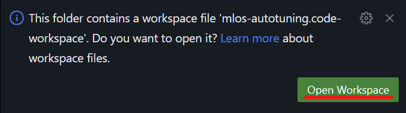

# MLOS Autotuning for Sqlite Repo

This repo is a fork of the [mlos-autotuning-template](https://msgsl.visualstudio.com/MLOS/_git/mlos-autotuning-template) repo.

It is meant as a basic class demo and example of tuning a local [`sqlite`](https://www.sqlite.org/) instance running via [`benchbase`](https://github.com/cmu-db/benchbase) and analyzing the results using [MLOS](https://github.com/microsoft/MLOS), a framework to help benchmark and automate systems tuning.

## Contents

<!-- TOC -->

- [MLOS Autotuning for Sqlite Repo](#mlos-autotuning-for-sqlite-repo)
    - [Contents](#contents)
    - [Background](#background)
    - [Overview](#overview)
    - [Setup](#setup)
        - [Prerequisites](#prerequisites)
            - [Codespaces](#codespaces)
            - [Local](#local)
        - [Prior to Class](#prior-to-class)
        - [Start of Class](#start-of-class)
    - [Using mlos_bench](#using-mlos_bench)
    - [Analyzing the Results](#analyzing-the-results)
    - [Troubleshooting](#troubleshooting)
    - [See Also](#see-also)
        - [Data Science APIs](#data-science-apis)

<!-- /TOC -->

## Background

Systems tuning is a difficult and time consuming task, yet more and more necessary as the complexity of cloud systems and all of their varied choices, different deployment environments, and myriad of workloads grows.
With it, we can reduce cost, improve performance, lower carbon footprint, improve reliability, etc., by fitting the system to the workload and its execution environment, tuning everything from VM size, to OS parameters, to application configurations.

To mitigate risk to production systems, we often employ offline exploration of this large parameter space to find a better config.
Benchmarks are needed to exercise the system, many parameter combinations should be tried, and data collected and compared.
This process has traditionally been done manually, which is both time consuming and error prone.
Noise in the cloud further makes it less reproducible.

The goal of autotuning systems like [MLOS](https://github.com/microsoft/MLOS) are to use automation and data driven techniques to help reduce the burden of this task and make it more approachable for many different systems and workloads in order to help bring the vision of an autonomous instance optimized cloud closer to reality.

## Overview

There are several items in this example:

1. Some configs and [example commands](#using-mlos_bench) to use `mlos_bench` to autotune a `sqlite` workload ([see below](#using-mlos_bench)).

    These can be run in the background while you explore the data in some of the other notebooks.

1. [`mlos_demo_sqlite.ipynb`](./mlos_demo_sqlite.ipynb)

    This is your workbook for this demo.
    Use it to analyze the data from running [`mlos_bench`](https://github.com/microsoft/MLOS) to find a better SQLite configuration and help understand what the optimizer found about the performance of that config.

    Initially, there won't be much data here to work with, until the commands from the loop in the previous step have run for a short while.

1. [`mlos_demo_sqlite_teachers.ipynb`](./mlos_demo_sqlite_teachers.ipynb)

    Here we analyze the data from running 100 trials of [`mlos_bench`](https://github.com/microsoft/MLOS) for SQLite optimization, as detailed in the instructions below.
    The results you obtain during this workshop should look similar to what we have in this notebook.

1. [`mlos_demo_mysql.ipynb`](./mlos_demo_mysql.ipynb)

    This notebook explores some existing data that we've collected with the [`mlos_bench`](https://github.com/microsoft/MLOS) tool while optimizing a MySQL Server on Azure.

    It is meant to familiarize yourself with the data access and visualization APIs while the commands from the first step gather new data for the `sqlite` demo in the background.

## Setup

### Prerequisites

For this demo, we will be using Github's Codespaces feature to provide a pre-configured environment for you to use.

#### Codespaces

- Just a [Github Account](https://github.com/account) :-)

#### Local

- [`VSCode`](https://code.visualstudio.com/download)

    For a more pleasant experience, we recommend connecting to the remote codespace using a local instance of VSCode, but it's not required.  You can also just use the web interface.

    > It is also possible to use a local checkout of the code using `git`, `docker`, and a [devcontainer](https://code.visualstudio.com/docs/devcontainers/containers), but we omit these instructions for now.

### Prior to Class

1. Create a [github account](https://github.com/account) if you do not already have one.
1. Open the [project](https://github.com/Microsoft-CISL/sqlite-autotuning/) in your browser.

    Navigate to the green **<> Code** drop down at the top of page and select the green **Create codespace on main** button.
    <!-- markdownlint-disable-next-line MD033 -->
    

1. Reopen the workspace (if prompted).
    <!-- markdownlint-disable-next-line MD033 -->
    

    Note: you can trigger the prompt by browsing to the [`mlos-autotuning.code-workspace`](./mlos-autotuning.code-workspace) file and following the prompt in the lower right to reopen.

1. Run the following code in the terminal at the bottom of the page, confirm you get an output back with help text.

    ```sh
    conda activate mlos
    mlos_bench --help
    ```

    You should see some help output that looks like the following:

    ```txt
    usage: mlos_bench [-h] [--config CONFIG] [--log_file LOG_FILE] [--log_level LOG_LEVEL] [--config_path CONFIG_PATH [CONFIG_PATH ...]] [--environment ENVIRONMENT] [--optimizer OPTIMIZER] [--storage STORAGE] [--random_init]
                      [--random_seed RANDOM_SEED] [--tunable_values TUNABLE_VALUES [TUNABLE_VALUES ...]] [--globals GLOBALS [GLOBALS ...]] [--no_teardown]

    mlos_bench : Systems autotuning and benchmarking tool

    options:
      -h, --help            show this help message and exit
      ...
    ```

1. **That's it!**  If you run into any issues, please reach out to the teaching team and we can assist prior to class starting.

### Start of Class

> These instructions use the Github Codespaces approach described above.

1. Open the codespace previously created above by browsing to the green `<> Code` button on the [project repo site](https://github.com/Microsoft-CISL/sqlite-autotuning) as before.

    - Use the "Open in VSCode Desktop" option from the triple bar menu on the left hand side to re-open the codespace in a local [VSCode](https://code.visualstudio.com/Download) instance.

    <!-- markdownlint-disable-next-line MD033 -->
    

    > Note this step is optional, but recommended for a better experience.
    > You can alternatively stay in the browser interface for the entire demo.

1. Make sure the local repo is up to date.

    > To be executed in the integrated terminal at the bottom of the VSCode window:

    ```sh
    # Pull the latest sqlite-autotuning demo code.
    git pull
    ```

1. Make sure the MLOS dependencies are up to date.

    > To be executed in the integrated terminal at the bottom of the VSCode window:

    ```sh
    # Pull the latest MLOS code.
    git -C MLOS pull
    ```

1. Make sure the `mlos_bench.sqlite` data is available.

    > To be executed in the integrated terminal at the bottom of the VSCode window:

    ```sh
    # Download the previously generated results database.
    test -f mlos_bench.sqlite || wget -Nc https://adumlosdemostorage.blob.core.windows.net/adu-mlos-db-example/adu_notebook_db/mlos_bench.sqlite
    ```

1. Activate the conda environment in the integrated terminal (lower panel):

    ```sh
    conda activate mlos
    ```

    <!-- markdownlint-disable-next-line MD033 -->
    

1. Make sure the TPC-C database is preloaded.

    > Note: this is an optimization.  If not present, the scripts below will generate it the first time it's needed.

    ```sh
    mkdir -p workdir/benchbase/db.bak
    wget -Nc -O workdir/benchbase/db.bak/tpcc.db https://adumlosdemostorage.blob.core.windows.net/adu-mlos-db-example/adu_notebook_db/tpcc.db
    ```

## Using `mlos_bench`

1. Run the `mlos_bench` tool as a one-shot benchmark.

    For instance, to run the sqlite example from the upstream MLOS repo (pulled locally):

    > To be executed in the integrated terminal at the bottom of the VSCode window:

    ```sh
    # Run the one-shot benchmark.
    # This will run a single experiment trial and output the results to the local results database.
    mlos_bench --config "./config/cli/local-sqlite-bench.jsonc" --globals "./config/experiments/sqlite-sync-experiment.jsonc"
    ```

    This should take a few minutes to run and does the following:

    - Loads the CLI config [`./config/cli/local-sqlite-bench.jsonc`](./config/cli/local-sqlite-bench.jsonc)
        - The [`config/experiments/sqlite-sync-experiment.jsonc`](./config/experiments/sqlite-sync-experiment.jsonc) further customizes that config with the experiment specific parameters (e.g., telling it which tunable parameters to use for the experiment, the experiment name, etc.).

            Alternatively, Other config files from the [`config/experiments/`](./config/experiments/) directory can be referenced with the `--globals` argument as well in order to customize the experiment.
    - The CLI config also references and loads the root environment config [`./config/environments/apps/sqlite/sqlite-local-benchbase.jsonc`](./config/environments/apps/sqlite/sqlite-local-benchbase.jsonc).

        - In that config the `setup` section lists commands used to
          1. Prepare a config for the `sqlite` instance based on the tunable parameters specified in the experiment config,
          1. Load or restores a previously loaded copy of a `tpcc.db` `sqlite` instance using a `benchbase` `docker` image.
        - Next, the `run` section lists commands used to
          1. execute a TPC-C workload against that `sqlite` instance
          1. assemble the results into a file that is read in the `read_results_file` config section in order to store them into the `mlos_bench` results database.

1. Run the `mlos_bench` tool as an optimization loop.

    ```sh
    # Run the optimization loop by referencing a different config file
    # that specifies an optimizer and objective target.
    mlos_bench --config "./config/cli/local-sqlite-opt.jsonc" --globals "./config/experiments/sqlite-sync-journal-pagesize-caching-experiment.jsonc" --max-iterations 100
    ```

    The command above will run the optimization loop for 100 iterations, which should take about 30 minutes since each trial should takes about 12 seconds to run.

    > Note: a 10 second run is not very long evaluation period.  It's used here to keep the demo short, but in practice you would want to run for longer to get more accurate results.

    To do this, it follows the procedure outlined above, but instead of running a single trial, it runs an optimization loop that runs multiple trials, each time updating the tunable parameters based on the results of the previous trial, balancing exploration and exploitation to find the optimal set of parameters.

    The overall process looks like this:

    <!-- markdownlint-disable-next-line MD033 -->
    

    > Source: [LlamaTune: VLDB 2022](https://arxiv.org/abs/2203.05128)

    While that's executing you can try exploring other previously collected data using the [`mlos_demo_mysql.ipynb`](./mlos_demo_mysql.ipynb) notebook.

## Analyzing the Results

1. Use the [`mlos_demo_sqlite.ipynb`](./mlos_demo_sqlite.ipynb) notebook to analyze the results.

    To do this, you may need to activate the appropriate python kernel in the Jupyter notebook environment.

    1. Select `Python Environments` from the `Select Kernel` menu in the upper right of the notebook:

        <!-- markdownlint-disable-next-line MD033 -->
        

    2. Select `mlos` from the options listed:

        <!-- markdownlint-disable-next-line MD033 -->
        

## Troubleshooting

Here's a short list of some tips/tricks of things to try in case you encounter some issues during the demo:

- If the "Select Kernels" menu is hanging during the notebook steps,

    Or, if the `mlos_bench --help` step returns a `command not found` error,

    Then, try to

    1. Update and/or restart VSCode
    2. Restart your codespace

## See Also

Here are some additional sources of information:

- [MLOS](https://github.com/microsoft/MLOS) - the main repo for the `mlos_bench` tool.

### Data Science APIs

- [`matplotlib` for Beginners](https://matplotlib.org/cheatsheets/handout-beginner.pdf)
- [`pandas` `Dataframe` Overview](https://www.w3schools.com/python/pandas/pandas_dataframes.asp)
- [`seaborn` Scatterplots](https://www.golinuxcloud.com/seaborn-scatterplot/)
